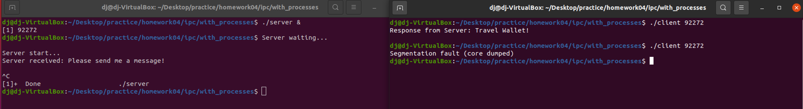

## :camera_flash: Screenshots

  
1. ./server & : 서버를 백그라운드로 실행(위 그림에서 [1]은 Shell job ID, (92272)는 Process ID
2. 위에서 구한 Process ID를 ./client 92272와 같이 인자로 넘겨준다.
3. Server는 SIGUSR1 시그널을 받을 때까지 지연되며, ./client 92272를 통해 Client는 Server에 kill을 통해 시그널을 보낸다.
4. SIGUSR1 시그널을 받은 Server는 Client가 공유메모리에 저장한 "Please send me a message!"를 읽어들여 출력한다.
5. 그다음, Server는 Travel Wallet!이라는 문자열을 공유 메모리에 저장하고 Client 에서는 해당 저장된 공유 메모리 데이터를 화면에 출력한다.(Response from Server: Travel Wallet!). 
6. ./client 92272를 다시 실행하면, segmentation fault 발생(공유 메모리가 제거 되었기 때문)
