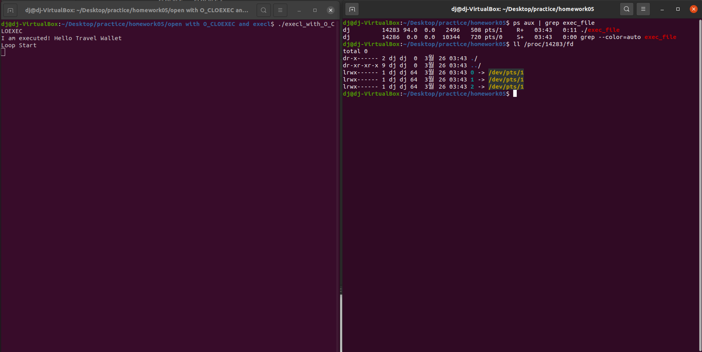

## :camera_flash: Screenshots

[O_CLOEXEC 없이 실행한 결과]

  
1. O_CLOEXEC 이용하여 실행한 결과, ./exec_file을 통해 exec_file을 실행하였을 때. 
2. ps aux | grep exec_file 을 통해 현재 돌고 있는 프로세스 중 'exec_file'을 찾는다.
3. ll /proc/{pid}/fd 를 터미널에서 입력하면 O_CLOEXEC 사용하였을 때 있었던 fd '3'이 현재는 없다.
