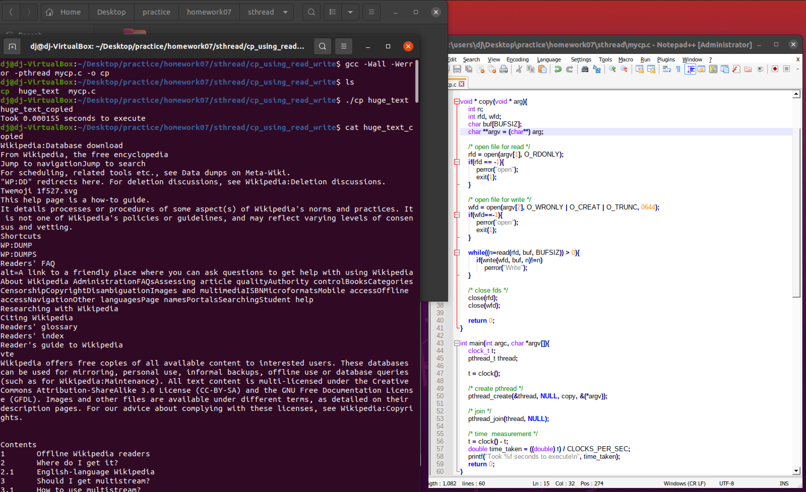

## :camera_flash: Screenshots

## :clock1: Time Measurement

- Average: 0.000155 seconds

Read, write을 사용하는 것이라면 쓰레드(싱글)를 사용하는 의미가 전혀 없어보인다.  
멀티 쓰레드를 사용한다해도 의미는 없어보인다.  
- 일정 크기만큼 읽어와서 write을 실행하는 데, 멀티 쓰레딩으로 해야 한다면, 어디서부터 어디까지 몇 사이즈만큼 읽어야 할지 각 쓰레드에서 결정해서 실행해야 할듯.